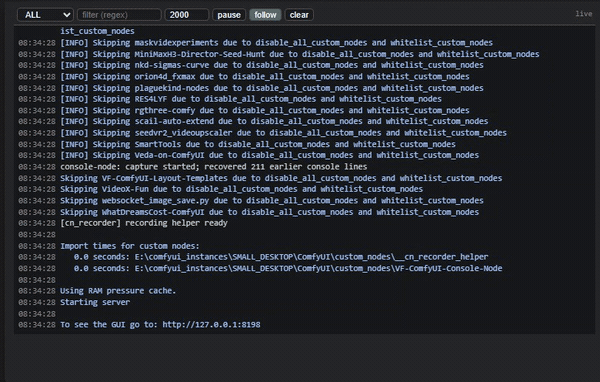
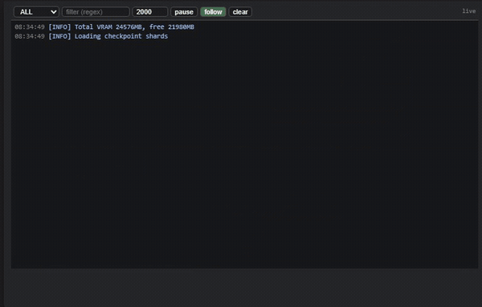
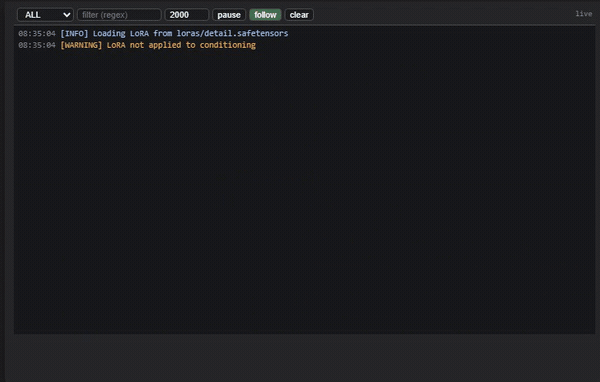
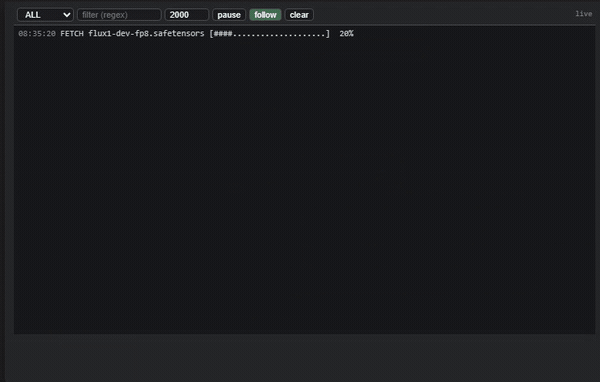
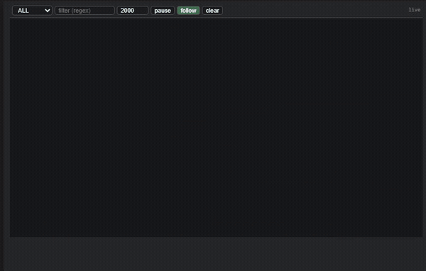
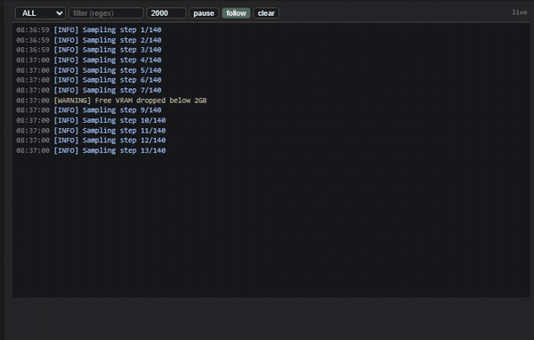

# 🌀 VF Console Log Viewer

Mirror the ComfyUI server console onto the canvas as a node — filter it,
colour it by level, pause it while a long job runs, and keep a rotating
plain-text copy on disk for when the canvas is not enough.



## Features

- **Live stream over SSE** — the server pushes each captured line to every
  open viewer; no polling and no workflow execution involved.
- **Startup backlog** — on builds that keep a console backlog, lines printed
  before this pack loaded are recovered and shown immediately, so the viewer is
  never empty when you drop it on the canvas.
- **Severity filter and colour coding** — `ALL` / `INFO` / `WARN` / `ERROR`, with
  each line coloured by level and timestamps dimmed.
- **Regex filter** — a case-insensitive pattern box; an invalid pattern turns
  its border red instead of silently dropping every line.
- **In-place progress stays in place** — `\r` updates (tqdm bars and friends)
  replace the previous line live rather than flooding the view with thousands
  of near-identical rows.
- **Pause, follow and trim** — pause rendering while the server keeps
  buffering, resume to catch up in one rebuild, and cap how many lines the
  viewer holds.
- **Click to copy** — clicking a timestamp copies that line, so a traceback can
  leave the canvas and go into an issue.
- **Rotating disk log** — the same lines are appended to a plain-text file under
  your ComfyUI user directory, ready for `grep`.

## Install

### ComfyUI Registry (recommended)

Install from the node manager: search for **VF Console Log Viewer** by publisher
`vktrflo`, or run one of:

```bash
comfy node install vf-comfyui-console-node            # via ComfyUI-Manager
comfy node registry-install vf-comfyui-console-node   # direct from the Registry, no Manager needed
```

The argument is the lowercase **Registry ID**, not the GitHub repository name.

### Manual

```bash
cd <ComfyUI>/custom_nodes
git clone https://github.com/vktrflo/VF-ComfyUI-Console-Node.git
```

Restart ComfyUI. There are no Python dependencies to install.

## Use

Add node → `utils/debug` → **🌀 VF Console Log Viewer**. Drop it anywhere on the
canvas; it takes no inputs and produces no outputs, so it never needs wiring
into a workflow.

### 1. It just streams


Everything the server prints appears as it happens. The console-node's own
startup notices show inline like any other line.

### 2. Filter by severity



The dropdown filters what is *rendered*. The stream keeps running underneath,
so switching back to `ALL` brings the hidden lines straight back.

### 3. Filter by regex



The pattern is matched case-insensitively against the line text. If it does not
compile, the box turns red and the previous filter stays active rather than
blanking the view.

### 4. Progress bars replace themselves



This is the behaviour that makes the node usable during downloads and sampling.
A `\r` update rewrites the current line, so a 200-step progress bar occupies one
row that ticks upward instead of 200 rows.

### 5. Pause and resume



`pause` stops rendering but not capturing — the server keeps buffering. Leaving
pause replays everything that arrived in one rebuild.

### 6. Follow and buffer limits



`follow` keeps the newest line in view; turn it off to scroll back through
history while output continues. The number box caps how many lines the viewer
keeps (100–20000, default 2000); older rows are dropped from the top.

### Controls

| Control | What it does |
|---|---|
| `ALL` / `INFO` / `WARN` / `ERROR` | Minimum severity to render |
| `filter (regex)` | Case-insensitive regex; red border when invalid |
| number box | Lines retained in the viewer (100–20000, default 2000) |
| `pause` | Stop rendering; the server keeps capturing |
| `follow` | Auto-scroll to the newest line |
| `clear` | Empty the viewer (does not touch the disk log) |
| click a timestamp | Copy `[HH:MM:SS] text` to the clipboard |

The status word on the right reports `live`, `connecting…` or `reconnecting…`.

## Disk log

Lines are appended to `<ComfyUI user dir>/console-node/console.log` as

```text
[YYYY-MM-DD HH:MM:SS] [LEVEL] text
```

It rotates at 5 MB keeping 3 backups (`console.log.1`, `.2`, `.3`), so you can
grep a failure long after scrolling past it. In-place `\r` updates are not
written — only finished lines are, which keeps the file free of progress-bar
noise.

## Configuration

All settings are environment variables, read once at startup:

| Variable | Default | Purpose |
|---|---|---|
| `COMFYUI_CONSOLE_NODE_BUFFER` | 2000 | Server ring buffer size (lines) |
| `COMFYUI_CONSOLE_NODE_CLIENT_QUEUE` | 5000 | Per-viewer queue size (lines) |
| `COMFYUI_CONSOLE_NODE_ROTATE_BYTES` | 5242880 | Disk log rotation threshold |
| `COMFYUI_CONSOLE_NODE_MAX_BACKUPS` | 3 | Rotated files kept |

If the server outruns a viewer, the oldest queued lines are dropped and a
`console-node: viewer fell behind` notice appears inline rather than the stream
stalling.

## How levels are assigned

ComfyUI does not tag plain `print()` output with a severity, so levels are
inferred from the line text:

- contains `error`, `exception`, `traceback` or `critical` → `ERROR`
- contains `warn`, `warning` or `deprecat…` → `WARN`
- begins with `[INFO]` or `[DEBUG]` → `INFO`
- otherwise `STDOUT` / `STDERR` depending on which stream it came from

Lines that reach the server through the `logging` module keep their real level.
Classification is deliberately forgiving — a `print()` saying "no error" is
still red — so treat the colours as a reading aid, not a contract.

## Behavior notes

- **ANSI escapes are stripped**, so colours and OSC links from the console do
  not leak into the viewer.
- **The real terminal keeps working.** Output is proxied, not replaced, so the
  ComfyUI console you launched still scrolls normally.
- **Disk-log failures never break capture.** If the log file cannot be written
  the node prints one `[console-node] disk log unavailable` notice and keeps
  streaming in memory.
- The node is resizable; the log area grows with the node and scrolls once it
  reaches its clamp.

## Limitations

- Lines printed before this pack loads are only recovered on ComfyUI builds
  that keep a console backlog (`app.logger.get_logs()`), such as the
  small-desktop builds.
- Writes via `stream.buffer` (raw binary) are not captured.
- `contextlib.redirect_stdout` temporarily bypasses capture while active.
- This node is an observer. It never mutates workflow state and is safe to
  delete from a canvas at any time.

## License

MIT — see [LICENSE](LICENSE).